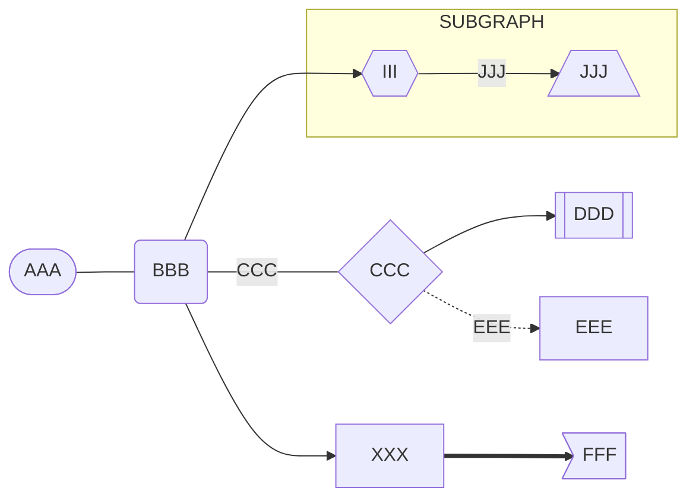
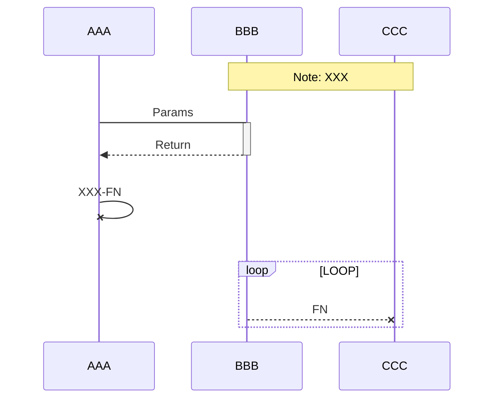
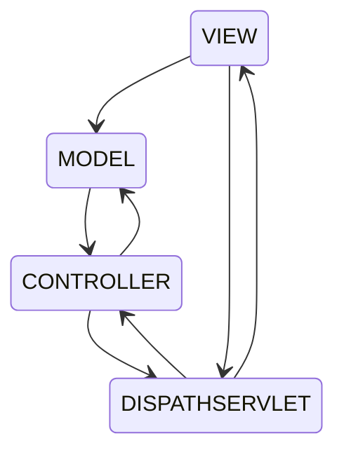

# Example For Light-Texture Theme

[TOC]

## HEADERS

### This is the H3 header
#### This is the H4 header
##### This is the H5 header
###### This is the H6 header

----

## TABLE

---

|  Nmae  | Company |  languages  |
| :--: | :--: | :--: |
| Ben | Google |  `Dart` \| `Kotlin` |
|  Hank  |  Alibaba  | `TypeScript` \| `Python` \| `Go`  |
|  William  |  Tencent  |  `Rust` \| `Java`  |

----


## QUOTED
> We can write some great text here, or write a great quote text.
>
> > This must be very interesting


----

## CODE BLOCK

```js
function xxx(args) {
  const ret = `The parameter passed in is ${args}`
  return ret
}

console.log(xxx('XXX', 666, [{ id: 1 }, { id: 2 }]))
```

----

## HTML

<div style="background: #F0E1ED; border: 1px solid #c41d7f; padding: 10px; border-radius: 5px">XXX</div>

----

## KBD

- Copy：<kbd>CTRL/COMMAND</kbd> + <kbd>C</kbd>
- Paste：<kbd>CTRL/COMMAND</kbd> + <kbd>V</kbd>

----

## FOOTNOTE

We can create a footnote[^FN] here. 

----

## MATH

$$
\begin{bmatrix}
{a_{11}}&{a_{12}}&{\cdots}&{a_{1n}}\\
{a_{21}}&{a_{22}}&{\cdots}&{a_{2n}}\\
{\vdots}&{\vdots}&{\ddots}&{\vdots}\\
{a_{m1}}&{a_{m2}}&{\cdots}&{a_{mn}}\\
\end{bmatrix}
$$

----

## LIST

### TASK LIST
- [x] Complete typora theme development
- [ ] Learn rust language
- [ ] Write an open source software

### ORDERED LIST
1. Open the refrigerator
2. Stuff the Elephant in the Refrigerator
3. Close the refrigerator

### UNORDERED LIST
- XXX-1
- XXX-2
  - XXX-2-1
- XXX-3

----

## FONT STYLE

**BOLD**
*ITALIC*，_ITALIC_
***ITALIC BOLD***
~~STRIKETHROUGH~~
<u>UNDERLINE</u>
[LINK](https://github.com/xxxDeveloper)
🤔

----

## GRAPH

### SEQUENCE
```sequence
XXX->YYY: HALO YYY, HOW ARE YOU ?
Note right of YYY: YYY THINKS
YYY-->XXX: FINE THANKS !
```

### FLOW
```flow
start=>start: START
operation=>operation: OPERATION
condition=>condition: YES OR NO?
error=>operation: RESTART
end=>end: END

start->operation->condition
condition(yes)->end
condition(no)->error(top)->operation
```

### MARMAID


#### FLOWCHAT



#### SEQUENCE


#### STATE



----

## ASSETS

### IMAGE


### VIDEO

<video src="https://rr5---sn-npoldn7z.googlevideo.com/videoplayback?expire=1644873377&ei=QXIKYouDHNXJx_AP0Pm6uAI&ip=94.46.220.95&id=o-AO3yyl7uDdTi3v8uSN7xnhsL-wqQ80xuBuU1JRlzJ06s&itag=18&source=youtube&requiressl=yes&vprv=1&mime=video%2Fmp4&ns=BQJXQccE0lA3zg-2YHORyCkG&gir=yes&clen=5229495&ratebypass=yes&dur=114.660&lmt=1575928905318175&fexp=24001373,24007246&c=WEB&txp=2311222&n=pqGTYSCnifqr9A&sparams=expire%2Cei%2Cip%2Cid%2Citag%2Csource%2Crequiressl%2Cvprv%2Cmime%2Cns%2Cgir%2Cclen%2Cratebypass%2Cdur%2Clmt&sig=AOq0QJ8wRgIhANfTdRgj0GtErwb7K2y1NXA6s-x0WOV1F8Z2eHxSW4rJAiEAhHYDQiuKOpJXZRNRt9GyjB8WicK7NWkEbZxUTrMi34o%3D&redirect_counter=1&cm2rm=sn-aiges676&req_id=1bc0f67c0612a3ee&cms_redirect=yes&mh=YY&mip=103.144.149.88&mm=34&mn=sn-npoldn7z&ms=ltu&mt=1644851568&mv=m&mvi=5&pl=23&lsparams=mh,mip,mm,mn,ms,mv,mvi,pl&lsig=AG3C_xAwRAIgQD10BFg0un8hH1JgNGSc5wLh4CjJdSaqAsX4o38Cj1wCIFQhT6BqmGmOHbZEbrfUmQWO7WN4Sr9EqtKrGZNUbBZi" />


----


## OTHER

[^FN]: This is a **FN** Footnote


