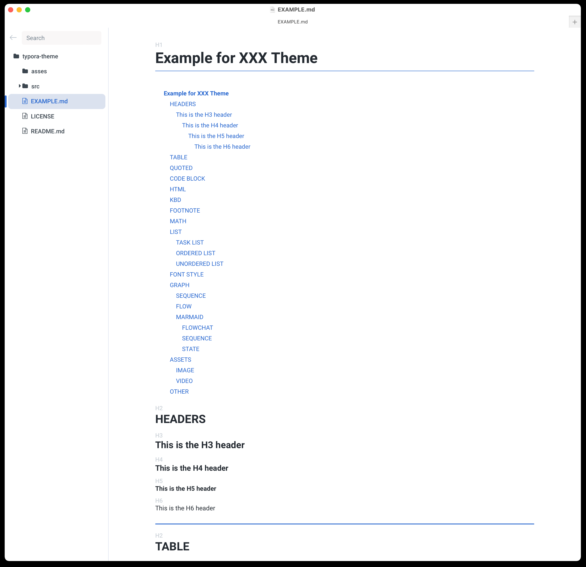
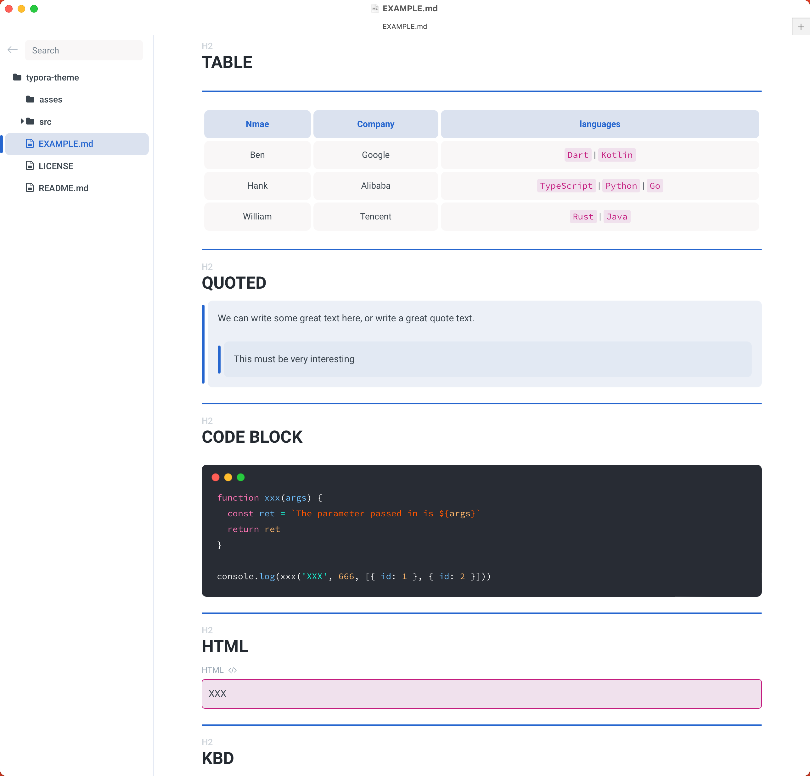
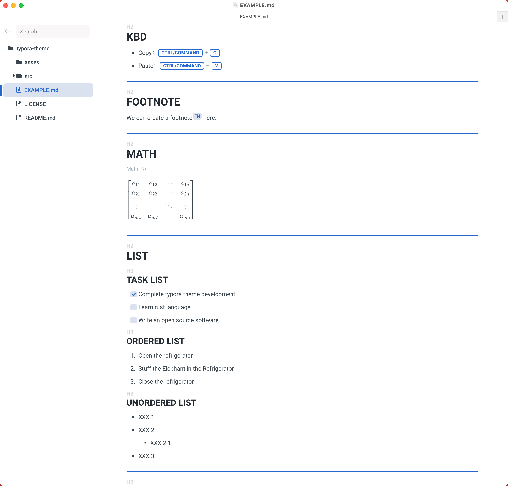
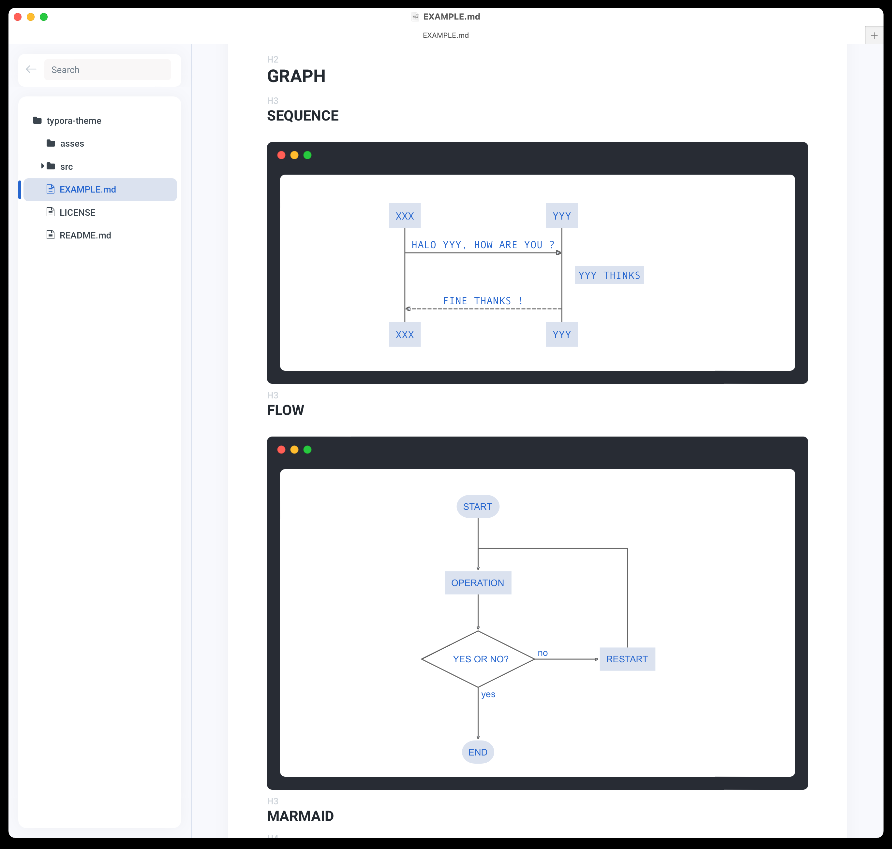
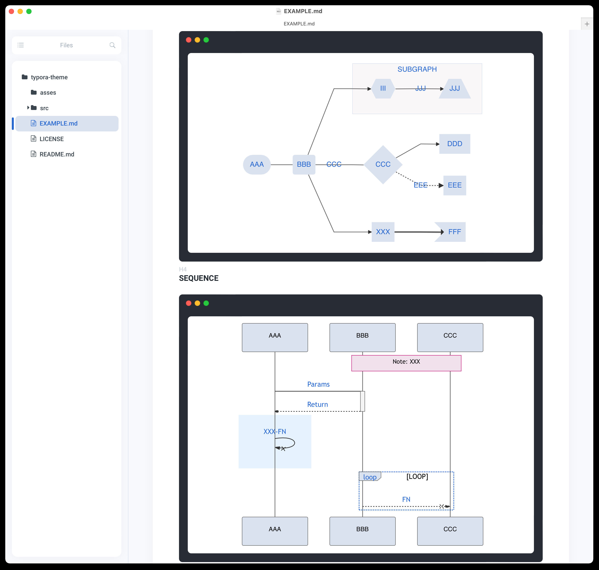
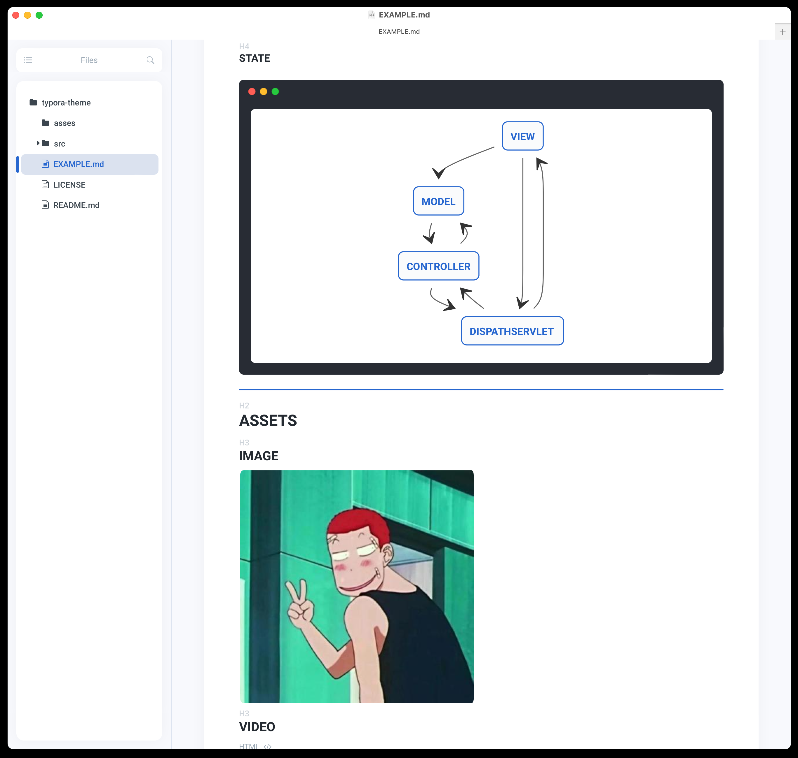
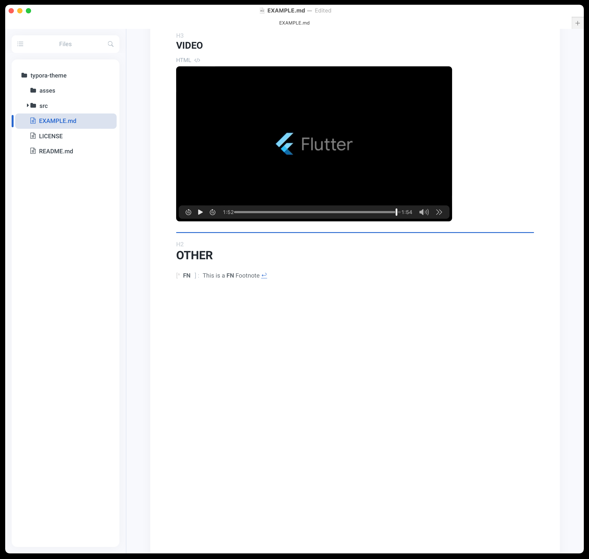

# Typora Light-Texture Theme

A good-looking theme will arouse our desire to write and motivate us to learn.

English |	[`中文`](./REDME_CN.md)

## What

A light textured typora theme, simplicity is not easy.

## Install

1. [`Download theme pack.`](https://github.com/xxxDeveloper/typora-light-texture-theme/releases/download/v1.0.2/LightTexture.zip)
2. Unzip the Light Texture theme package into the typora theme package.
3. Select Light Texture theme in typora.

## Screenshots

## Reference

This project references the following projects：

 - [`typora-gitbook-theme`](https://github.com/h16nning/typora-gitbook-theme)
 - [`typora-panda-theme`](https://github.com/gilbertohasnofb/typora-panda-theme)
