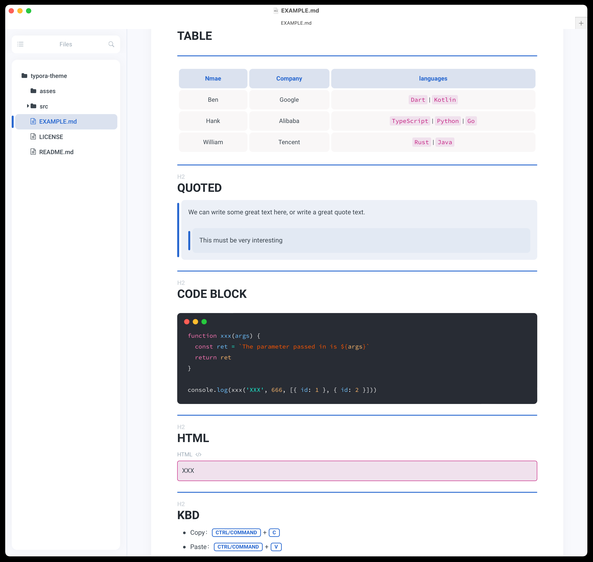
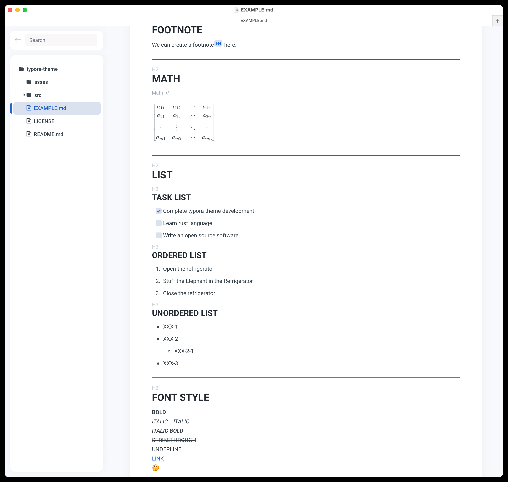

# Typora XXX Theme

Good-looking themes inspire us to write and inspire us to learn.

## Why

Why is it called xxx theme ???
Because I haven't figured out the name of the theme yet ~~~

## Install

1. [`Download theme pack.`](https://github.com/xxxDeveloper/typora-theme/releases/download/v1.0.0/xxx-theme.zip)
2. Unzip the xxx theme package into the typora theme package.
3. Select xxx theme in typora.

## Screenshots

## Reference

This project references the following projects

 - [`typora-gitbook-theme`](https://github.com/h16nning/typora-gitbook-theme)
 - [`typora-panda-theme`](https://github.com/gilbertohasnofb/typora-panda-theme)