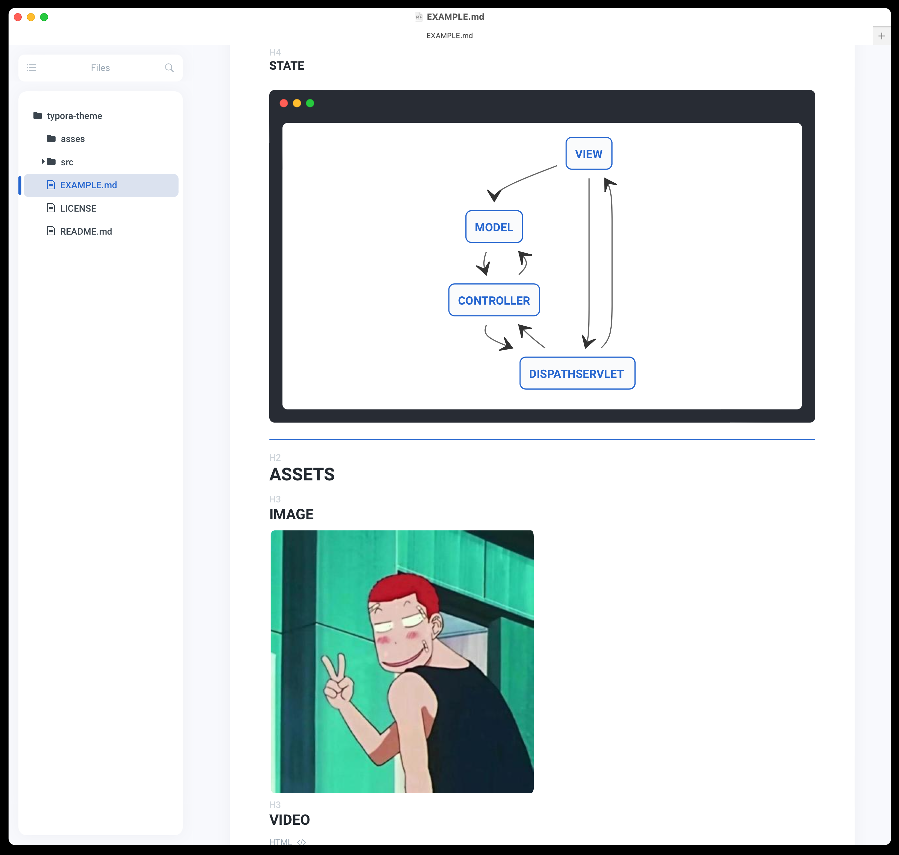

# 轻质感Typora主题

一款好看的主题会激起我们的写作欲望和激励我们学习

[`English`](./REDME.md) |	中文

## 什么

一个轻质感的typora主题，简约而不简单

## 安装

1. [`下载主题包`](https://github.com/xxxDeveloper/typora-light-texture-theme/releases/download/v1.0.2/LightTexture.zip)
2. 将Light Texture主题包解压到typora主题包中
3. 在typora中选择Light Texture主题

## 截图

## 参考

本项目参考以下项目：

 - [`typora-gitbook-theme`](https://github.com/h16nning/typora-gitbook-theme)
 - [`typora-panda-theme`](https://github.com/gilbertohasnofb/typora-panda-theme)